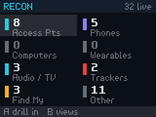
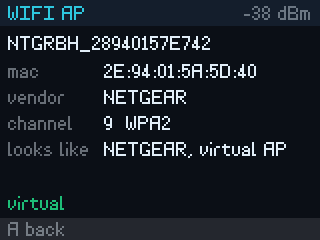

# recon

A WiFi and Bluetooth scanner for the [Pimoroni Tufty 2350](https://github.com/pimoroni/tufty2350)
badge that tells you what things **are**, not just that they exist.




Your phone can list nearby networks. It will not tell you that the strongest
signal in the room is a Chamberlain garage-door opener, that three of the
access points sharing one SSID come from two different manufacturers, or that
something Tile-shaped has been within a few metres of you for the last hour.
This does, on a battery-powered badge, with no network connection.

**What it is useful for**

- Seeing which trackers are near you, and which are *following* you
- Spotting access points that look like rogues: open networks impersonating
  secured ones, one SSID served by mismatched hardware
- Knowing what a room is actually made of before you trust its WiFi
- Keeping a de-duplicated log of a whole conference and pulling it off as CSV

## Measured

A couple of hours moving through mixed residential and commercial areas:

| | Result |
| --- | --- |
| Access points logged | **214**, 86% named by manufacturer |
| Bluetooth devices logged | **128**, 74% identified |
| Apple Find My beacons | 356 addresses, from roughly 55 real devices |

It named cable-company gateways, Tile trackers, AirPods, Govee sensors, smart
home hubs and a garage-door opener without any network lookup.

## What it does not do

Worth being clear, because the badge is not a Pineapple:

- **2.4GHz only.** The cyw43 radio cannot see 5GHz or 6GHz at all, so a
  meaningful share of modern access points are invisible to it. Every channel
  it can report is 1–14.
- No monitor mode, no packet capture, no probe-request harvesting
- No deauthentication, injection, or anything else that transmits
- No decryption of anything, ever

It reads beacons and advertisements, which every device broadcasts openly to
anyone listening. That is the whole mechanism.

## Privacy

This tool records identifiers belonging to other people's devices, and the
export is deliberately easy to read. Passive collection is not the same as
harmless collection, so:

- MAC addresses are personal data in many jurisdictions, including everywhere
  the GDPR applies. A conference has international attendees.
- The log is for **your own RF awareness**. Publishing a capture, or
  cross-referencing it against people, is a different act from taking it.
- Randomised and rotating addresses exist because people opted into not being
  tracked. This tool deliberately does not defeat that: rotating addresses are
  counted, never logged as identities.
- Local law varies. Passive reception is broadly lawful in the US and much of
  Europe; retention and processing of the results is the part with rules
  attached.

Erase the log when you no longer need it. **UP+DOWN** held for two seconds on
the LOG view, or `tools/export_log.py --erase`.

## Install

No toolchain, no Python.

1. Download the zip from [Releases](https://github.com/jgamblin/tufty-recon/releases).
2. Plug the badge in and open its **Mass Storage** app. A `TUFTY` drive appears.
3. Open the zip's `apps` folder and drag `recon` into `TUFTY/apps`, then eject.
   On macOS you can double-click `install-macos.command` instead.

Needs badgeware firmware **v2.0.2 or newer**.

## Using it

| View | Shows |
| --- | --- |
| **BILLBOARD** | One big number, readable from a couple of metres. For wearing it facing outward. |
| **DASH** | What is around you, counted by kind. Pick a row, press **A** to see only those. |
| **LIVE** | Everything in range, strongest first. **A** opens a detail page. |
| **FLAGS** | Open networks, WEP, possible evil twins, trackers, Find My. |
| **VENDORS** | Who makes the hardware in this room. |
| **LOG** | The persistent tally, and how full the log is. |
| **SHARE** | A QR to this repository and the URL, for when someone asks. |

**B** next view · **A** drill in / detail / back · **UP/DOWN** scroll ·
**C** clear filter or cycle wifi/ble · **HOME** back to the launcher

It opens on BILLBOARD, which exists because every other view is designed for
arm's length: at 12px a capital subtends about 7 arcminutes from two metres,
under the ~10 needed to read at a glance. The billboard sets its number at up
to 76px, around 34 arcminutes, so it is legible to someone walking behind you.

## How it identifies things

Two databases, compiled to sorted fixed-width binaries and searched on the
badge itself:

- **39,877 IEEE MA-L prefixes** → hardware manufacturer
- **3,988 Bluetooth SIG company IDs** → chipset and brand

plus hand-written tables for Apple Continuity subtypes, GAP appearance values,
notable service UUIDs, and SSID naming conventions.

The 195KB key index lives in RAM, which takes a lookup from 11ms on flash to
1.8ms. Even that is an eighth of a frame, so devices are identified lazily at
two per frame and a crowded room never stalls the display.

Rebuild the databases from the upstream registries at any time:

```bash
python3 tools/build_id_db.py
```

## Getting the log off

```bash
python3 tools/export_log.py            # -> exports/recon-<date>-{wifi,ble}.csv
python3 tools/export_log.py --erase    # and clear the badge
```

The badge stores fixed-width binary records to fit a four-day conference in a
1MB filesystem, taking a bounded 560KB slice and saying so on screen when full
rather than silently dropping records. The exporter resolves vendors against
the same databases, so the CSV stands alone.

## Things it gets right that are easy to get wrong

**Bluetooth address rotation.** Phones and watches re-randomise their address
roughly every 15 minutes, so only stable addresses count as devices and
rotating ones are reported as an inflated upper bound.

A static-random address counts as a device only if its payload carries a name,
a company or a service, and does not belong to a rotating scheme. Everything
Apple advertises over Continuity rotates, and an address that advertises no
identity at all cannot be re-identified later even in principle. Skipping that
test turned one overnight capture in a single hotel room into 389 "devices",
of which 6 were real.

The address bits alone are not enough to decide this, which only became clear
with real data. Apple's Find My beacons derive their address from a key that
rotates about every 15 minutes but present as **static random**, which by the
bits looks permanent. In one two-hour outing that meant 356 distinct Find My
addresses in 96 minutes, 116 of them inside a single 10-minute window: roughly
55 real devices, not 356. Rotation is decided from the payload as well as the
address.

**Find My is not a tracker count.** That beacon comes from every iPhone and Mac
with Find My enabled, not just AirTags. It gets its own bucket, and the flags
page says so on screen. Only dedicated trackers count as trackers.

**Virtual BSSIDs.** An access point running several SSIDs derives extra BSSIDs
by twiddling the low bits of the first octet, and vendors differ: Google flips
exactly the locally-administered bit (7C → 7E), Netgear sets three (28 → 2E).
The top five bits survive either way, so all eight candidates are tried. In the
capture above, 106 of 214 access points were virtual. The ones that still miss
are left unknown rather than guessed, because a confidently wrong vendor is
worse than none on a tool for spotting rogue hardware.

**Evil-twin false positives.** The heuristic flags an SSID served by multiple
vendors, but unrecovered virtual BSSIDs would each look like a distinct unknown
vendor and flag every multi-SSID home router. Only identified vendors count.

**Radio contention.** WiFi and BLE share one radio. With BLE holding a
continuous scan, `wlan.scan()` still returns access points but every RSSI comes
back as **0**. The BLE listen is paused for the couple of seconds a WiFi scan
takes.

## Development

Tested on macOS. `deploy.sh` also handles Linux mount points; on Windows use
the zip from Releases.

```bash
python3 -m venv .venv && .venv/bin/pip install mpremote pillow
tools/deploy.sh
```

Verify on the hardware before a conference does it for you:

```bash
tools/run.sh tools/smoke.py          # finds the badge itself
tools/run.sh tools/stress_recon.py
```

`smoke.py` runs the app for 40 frames and reports failures, framerate and
memory. `stress_recon.py` drives it at conference scale with synthetic devices,
which is how most of the performance work got found: every view holds under
11ms a frame up to 1800 devices.

Every screenshot here came off the hardware, not a mockup — the framebuffer is
plain RGBA8888 and `screen.raw` exposes it:

```bash
.venv/bin/python tools/screenshot.py recon --setup 'm.view = 2' -o shots/flags.png
```

**[NOTES.md](NOTES.md)** has the engineering detail: what the scale work cost,
the on-disk format, and the full tool list.

## Related

The badge faces and other apps this grew out of live in
[jgamblin/Tufty2350-Badgeware](https://github.com/jgamblin/Tufty2350-Badgeware).

## Licence

MIT, see [LICENSE](LICENSE).

The vendor databases are compiled from the [IEEE MA-L registry](https://standards-oui.ieee.org/)
and the [Bluetooth SIG assigned numbers](https://www.bluetooth.com/specifications/assigned-numbers/),
both published for public reference by their respective bodies. They are
included as a build artifact for convenience; `tools/build_id_db.py` regenerates
them from source at any time.
